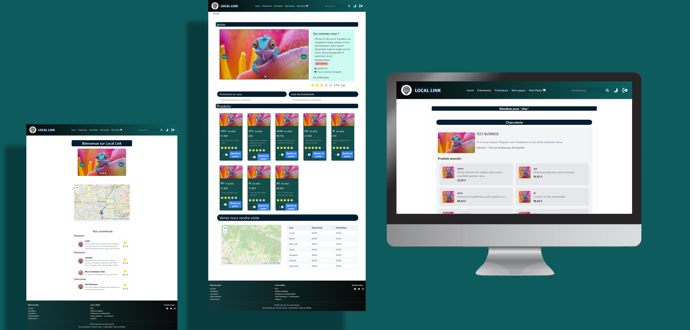

# Local Link - Projet web - Click and Collect - Exercice -- Février 2025

Local Link est une application web développée avec Symfony dans le cadre d’un **projet pédagogique**. Projet réalisé en groupe. 

Elle propose un système de **click and collect local**, permettant aux utilisateurs de consulter les points de retrait (producteurs, commerçants, artisans…), de découvrir les produits disponibles et de passer commande en ligne pour un retrait sur place.

Le projet inclut également une **API intégrée** pour permettre des extensions vers une application mobile ou des services externes. 

---
## Technologies

- PHP 8.2
- Symfony 7
- API Platform
- Doctrine ORM
- JWT Authentication (LexikJWTAuthenticationBundle)
- LiipImagineBundle
- MySQL/MariaDB
- Apache2
- SweetAlert
- OpenStreetMap
  
---
## Fonctionnalités principales

- Authentification sécurisée par JWT
- Création et gestion des comptes utilisateurs
- Ajout, modification et suppression de produits
- Gestion des commerces et des catégories
- Système de panier et gestion des commandes
- Visualisation des commerces sur une carte interactive
- Commentaires et système de notation des commerces
- Gestion des promotions et des événements
- Modération et validation des commerçants par les administrateurs
- Tableau de bord administrateur
- API REST complète exposée avec API Platform

## Autohébergement sur serveur LAMP

Le projet Local Link est auto-hébergé sur une pile LAMP (Linux, Apache, MySQL, PHP) configurée manuellement sur une machine virtuelle Debian.

L’architecture repose sur :
- Apache2 2.4.62 
- PHP 8.2
- MySQL/MariaDB pour la base de données
- Symfony CLI 
- Reverse proxy 
- Protection par .htaccess

## Aperçu du projet 

### MCD & MLD
[MCD/MLD](public/images_projet_git/mcd_mld.png)

### Mock-Up

## Installation 
git clone https://github.com/LaMonaLisa34/LocalLink-ClickandCollect-exercice.git

